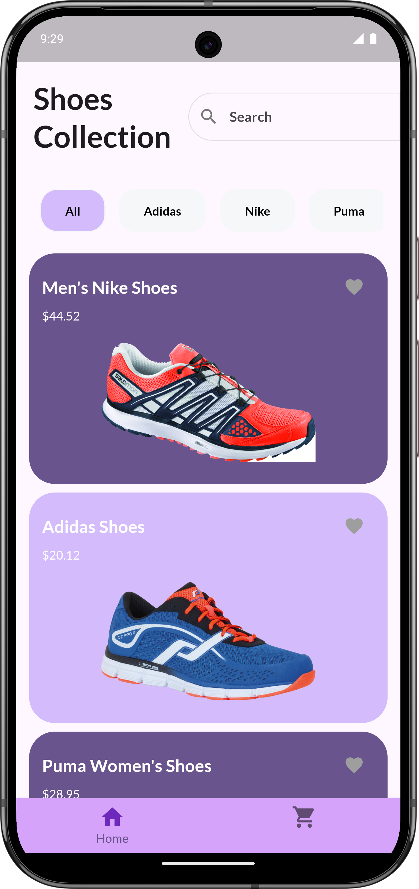
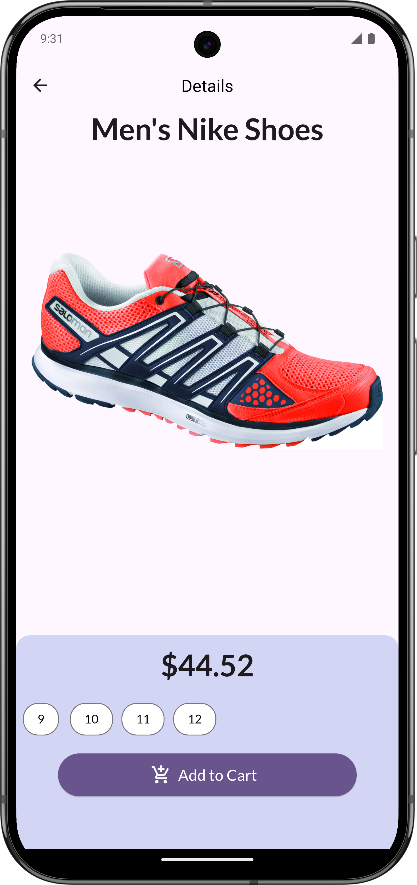
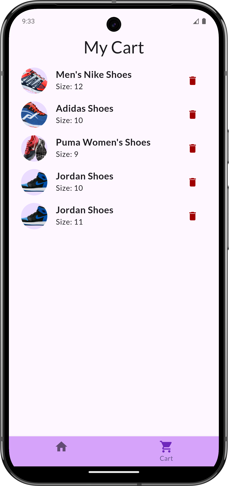

# Shopping App (Practice Project)

This project is a practice app built using Flutter. The primary focus of this app is to learn and understand various Flutter concepts such as theming, state management (using Provider), navigation, layout building, and more. The app does not prioritize advanced UX/UI design but serves as an excellent starting point for learning these Flutter features.

  


## Learning Objectives

This project was created to help the developer get familiar with the following key concepts:

- **Theming:** Learn how to define and apply different themes to customize the app's look and feel.
- **State Management (Provider):** Understand how to manage state across different widgets and pages using the Provider package.
- **Navigation:** Learn how to implement navigation between different screens using Flutter’s Navigator.
- **Layout Builder:** Explore how to build adaptive and flexible layouts with Flutter’s layout widgets (e.g., Column, Row, GridView).

## Setup

To get started with the project, follow the steps below:

1. **Clone the repository:**
   ```bash
   git clone https://github.com/codeprnv/shopping_app.git
2. **Install dependencies: Navigate to the project directory and run:**
    ```bash
    flutter pub get
3. **Run the app: To run the app on your emulator or connected device, use:**
    ```bash
    flutter run

## Folder Structure

- **`main.dart`**: The entry point of the application, where the app is initialized.
- **`models/`**: Contains the data models used throughout the app, such as the `Product` and `Cart` models.
- **`providers/`**: Contains the state management logic using the `Provider` package, allowing data to be shared across different parts of the app.
- **`screens/`**: Contains the various screens or pages in the app (e.g., Home, Cart).
- **`widgets/`**: Contains reusable UI components that can be used across multiple screens.
- **`theme/`**: Includes the files related to theming, such as light/dark themes and app styling.
- **`utils/`**: Contains utility functions or helper files to simplify various tasks in the app.

## Screenshots

1. **HomePage:**
   <br><br>
   
   <br><br>
   
2. **Details Page:**
   <br><br>
   
   <br><br>
   
3. **Cart's Page:**
   <br><br>
   
   <br><br>
